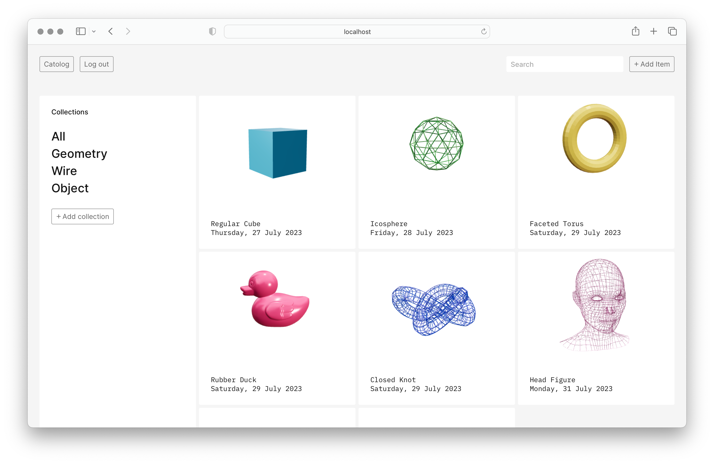

<p align="center">
  
</p>

Welcome to Catolog, the ultimate digital sanctuary for 3D object enthusiasts seeking order, creativity, and organization in their digital lives. Unleash your inner curator, declutter your digital world, and find inspiration in the beauty of 3D objects with Catolog. Join us today, and let's create a more organized and artful digital future together.

## Installation

1. Clone this repo and enter!

   ```bash
   git clone https://github.com/kevin-kowalski/catolog.git
   ```

2. Install dependencies.

   ```bash
   cd client  # ! Change into the client folder !
   npm install
   cd ./server  # ! Change into the server folder !
   npm install
   ```

## Getting started

Except for the regular suspects; git, Node, npm, you need a MongoDB running locally in order to work on Catolog.

1. Set up the database
* Set the database URL in the `server/.env` file DB_URL constant. The example is provided in the `.env.example` file.
* Set the JWT secret in 'server/.env' JWT_SECRET file constant. The example is provided in the `.env.example` file.

2. Run the application.

   ```bash
   npm run setup # ! Seed the database with example data !
   npm run start # ! Run the backend server !
   cd ./client  # ! Change into the client folder and run the frontend server !
   npm run dev
   ```

## Tech Stack

* [React](https://reactnative.dev/)
* [React Three Fiber](https://github.com/pmndrs/react-three-fiber)
* [Express](https://expressjs.com/)
* [MongoDB](https://www.mongodb.com/)
* [Mongoose](https://mongoosejs.com/)

## Developers

* Magdalena Keller - [GitHub](https://github.com/makekema) - [LinkedIn](https://www.linkedin.com/in//)
* Kevin Kowalski - [GitHub](https://github.com/kevin-kowalski) - [LinkedIn](https://www.linkedin.com/in//)

## Project Structure

Our development team, comprised of two members, took over an existing project ([Wee Three](https://github.com/aatoaa/wee-three)) from a colleague in the past. Our primary objective was to enhance and elevate the project, aiming for higher levels of functionality and code quality. We were actively engaged in code review, refactoring, and implementing new features to bring substantial improvements to the project. During this period, we made the following significant strides in its development.

### Enhancements

**Front End Enhancements:**
- Type Safety: Fixed TypeScript errors by adding missing types.
- Test Coverage: Wrote tests for components to ensure they display correctly based on the application state.
- Documentation: Added comments to all components for improved code understanding.

**Back End Enhancements:**
- Test Coverage: Implemented tests for models, controllers, and API requests for robust backend functionality.
- Documentation: Added comments to upper-level functions for clarity and maintainability.

### New Features

**Front End:**
- Authentication (MVP): Added user authentication for improved security.
- Gallery View (MVP): Introduced a gallery view for enhanced user experience.
- 3D Model CRUD (MVP): Enabled Create, Read, Update, and Delete operations for 3D models.
- Lists of 3D Models CRUD (Bonus): Added the ability to manage lists of 3D models for added functionality.

**Back End:**
- Authentication Changes (MVP): Implemented necessary changes in models and controllers to support user authentication.
- 3D Model CRUD Changes (MVP): Updated models and controllers to support the CRUD operations for 3D models.
- List Management Changes (Bonus): Introduced changes in models and controllers to enable CRUD operations for lists of 3D models.

These improvements have enhanced the codebase by addressing errors, adding testing for reliability, documenting for clarity, and introducing valuable new features for users.
